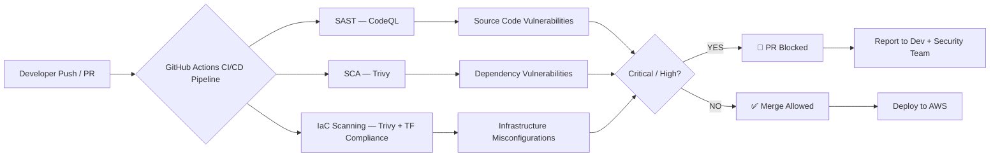

# 🔐 SecOps — DevSecOps CI/CD Security Pipeline

> Automated SAST · SCA · IaC Scanning · AWS · Terraform · GitHub Actions


---

## 📌 Overview

This project implements a **Secure Software Development Lifecycle (SSDLC)** by embedding automated security scanning directly into a GitHub Actions CI/CD pipeline running against AWS infrastructure provisioned with Terraform.

The goal is simple: **catch vulnerabilities before they reach production**, not after.

Security gates are enforced at three layers:

| Layer | Tool | What It Catches |
|---|---|---|
| **SAST** | CodeQL | Source code vulnerabilities, logic flaws, insecure patterns |
| **SCA** | Trivy | Vulnerable open-source dependencies (CVE/NVD database) |
| **IaC Scanning** | Trivy + Terraform Compliance | AWS misconfigurations, insecure Terraform patterns |

**Critical and High severity findings block pull request merges automatically.**

---

## 🏗️ Architecture



---

## 🔧 Components

### 1. Infrastructure as Code (IaC) — `main.tf`

AWS infrastructure provisioned with Terraform following security best practices:
- Least-privilege IAM policies
- Encrypted storage (S3, EBS)
- VPC network segmentation
- Security group hardening

**Scanning Tools:**
- **Trivy** — Detects misconfigurations in Terraform against AWS/CIS benchmarks
- **Terraform Compliance** — BDD-style policy assertions against infrastructure config

### 2. Static Application Security Testing (SAST)

**Tool: CodeQL (GitHub Advanced Security)**

- Analyses source code without execution
- Identifies injection vulnerabilities, insecure API usage, hardcoded secrets, and logic errors
- Runs on every push and pull request

### 3. Software Composition Analysis (SCA)

**Tool: Trivy**

- Scans `requirements.txt` and all project dependencies
- Cross-references the National Vulnerability Database (NVD) and GitHub Advisory Database
- Flags outdated packages with known CVEs

---

## 🚦 Security Gates

PR merges are **automatically blocked** when:
- Any **Critical** vulnerability is detected (CVSS ≥ 9.0)
- Any **High** vulnerability is detected (CVSS ≥ 7.0)

This enforces shift-left security — developers get feedback in their PR, not in a post-deployment audit.

---

## 📁 Repository Structure

```
secops/
├── .github/
│   └── workflows/          # GitHub Actions CI/CD pipeline definitions
├── main.tf                 # Terraform AWS infrastructure (IaC)
├── .terraform.lock.hcl     # Terraform provider lock file
├── requirements.txt        # Python dependencies (SCA target)
├── .gitignore
└── README.md
```

---

## 🚀 Getting Started

### Prerequisites
- AWS account with appropriate IAM permissions
- Terraform >= 1.0
- GitHub repository with Actions enabled

### Setup

```bash
# Clone the repository
git clone https://github.com/DY-CB/secops.git
cd secops

# Initialise Terraform
terraform init

# Preview infrastructure changes
terraform plan

# Apply infrastructure
terraform apply
```

The GitHub Actions workflow triggers automatically on push and pull request to the `main` branch.

---

## 🛡️ Security Frameworks Referenced

- **OWASP Top 10** — Application security risks
- **NIST Cybersecurity Framework** — Infrastructure security controls
- **CIS AWS Benchmarks** — Cloud configuration hardening
- **CVE / NVD** — Dependency vulnerability database

---

## 📜 Related Projects

- [Active Directory Home Lab](https://github.com/DY-CB/Active-Directory-Lab) — SIEM-based threat detection in simulated enterprise environment
- MSc Dissertation: Python-based Web Application Security Audit Tool — 100% precision, 12 live web applications scanned, 130+ minutes manual assessment time eliminated

---

## 👤 Author

**Oladayo Michael Suara**
MSc Cybersecurity · DevSecOps Trainee · ISO 27001 Certified

[](https://linkedin.com/in/oladayosuara)
[](https://github.com/DY-CB)

